Prevalence of CKD, Diabetes and associated risk factors by CCG and GP in
the Lister Hospital Catchement Area
================
Amarnath Marthi, July 2021

 

##### I have attempted to compile available data from Primary Care on current prevalence and practice in Diabetes and CKD care

 

### CKD prevalence by CCG, PCN and GP

#### Data is derived from CKD coding at GP practise level from the 2019-2020 QoF data.

#### QoF definition: patients aged 18 or over with CKD with classification of categoris G3a to G5 (previously stage 3 to 5)

 

#### Table of CKD prevalence by CCG for QoF data 2019-2020

 

#### However, this summary hides significant variation within CCG

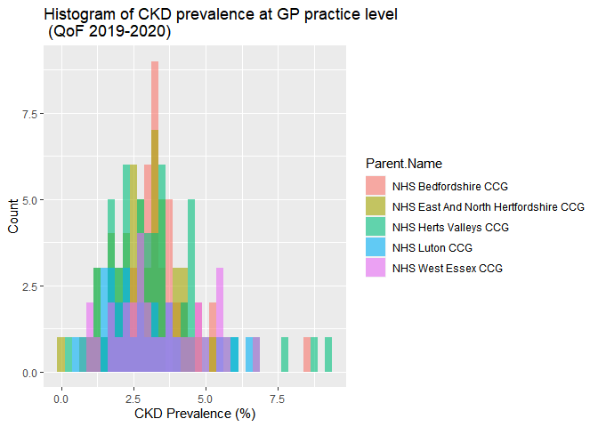<!-- -->  

 

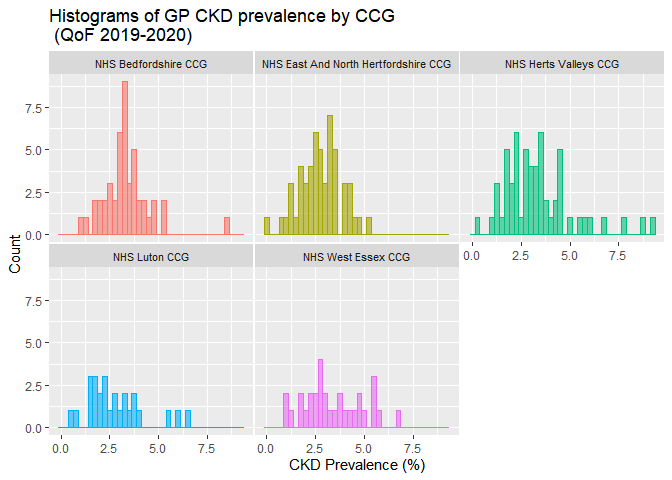<!-- -->

 

 

##### There is growing evidence that coding of CKD varies across GP practices: “Of those identified with CKD stage 3–5, individuals aged ≥50 years were more likely to be coded for CKD, compared with those aged &lt;50 years. Lower levels of coding were independently associated with deprivation and black Caribbean, black African, South Asian, and non-stated ethnicities, compared with white ethnicity” (Br J Gen Pract 2020; DOI: <https://doi.org/10.3399/bjgp20X713105>).

 

 

##### We can also seperate by Primary Care Networks (PCNs) which are GP conglomerates that control local commissioning of services. This suggests that PCNs in Herts Valley currently have the highest recorded prevalence of CKD. However, many of these patients may have long term stable CKD and CKD coding is likely not age-adjusted. Additionally, it may reflect the demographics of the population and their relation to clinical coding of CKD rather than true prevalence.

 

 

##### We can also assess whether CKD prevalence is associated with 2019 Deprivation Scores.

 

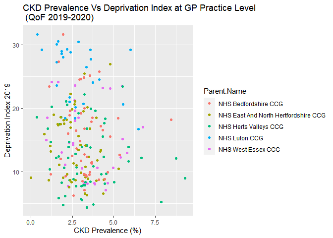<!-- -->

 

##### Higher scores suggest more deprivation at GP level and the Luton CCG appears to be associated with greatest deprivation scroes ingeneral. This counterintuitively suggests CKD prevalence is inversely correlated with CKD prevalence, with higher deprivation index associated with lower CKD prevalence: Pearson Correlation Coefficient - 0.16 (95% CI -0.03 to -0.29).

 

 

##### In summary, there is significant variation in CKD prevalence at GP practice level by CCG and Primary Care Network. Some of this variation will be true differences but other variation may be as a results of undercounting (uncoded CKD for a variety of reasons) as well as possible overcounting (non-age adjusted CKD prevalence).

##### To address this, efforts have been made to improve CKD coding in primary care as part of a larger quality improvement process (<https://doi.org/10.3399/bjgp19X704105>). Other studies have looked at identifying and clarifying CKD diagnosis from GP records using measures of GFR and proteinuria in the community (<https://bmcnephrol.biomedcentral.com/articles/10.1186/s12882-018-0882-9>). This clearly has implications for the virtual CKD project where we may provide practice level advice to GP surgeries on their patient cohort. Additionally, there are opportunities to integrate the Kidney Failure Risk Equation in to practise as this may become standard of care as per the updated NICE guidance due to be release in August this year.

 

#### QUALITY IMPROVEMENT MEASURE

##### To better understand this variation in East and North Hertfordshire, I propose using the Public Health Intelligence Unit from the Hertfordshire council to assess coding of CKD in GP practices and comparing this to QoF reported prevalence:

##### Define CKD as those patients with either

##### - GFR of &lt; 60 ml/min/1.73m2 with 2 readings atleast 90 days apart. The CKD-EPI equation will be used for GFR estimation from reported creatinine values or;

##### - Proteinuria: a urinary albumin:creatinine ratio (ACR) of ≥ 3 mg/mmol or a urinary protein:creatinine ratio (PCR) of ≥ 15 mg/mmol also atleast 90 days apart

 

##### We can then compare this with patients coded as CKD either in Primary Care or HES coding from secondary care admissions as well as compare those who are on the current ClinicalVision database as being followed up for CKD.

##### As has been previously studied, we can then assess whether there is variation in coding by ethnicity, GP practice and how this affects prescription of relevant medications such as statins and blood pressure control targets at an individual patient level.

### Diabetes and CKD

 

##### QoF data provides prevalence of Diabetes by GP surgery for patients aged 17 or over. Although the type of diabetes is not noted (e.g. Type 1 Vs Type 2 Vs Other), data is collected on patients initiated on RAASi by microalbuminuria criteria, statin prescription for primary (those aged over 40) and secondary prevention as well whether HbA1c and blood pressure targets are met.

 

##### Firstly, we can assess for variation in Diabetes prevalence at GP practice level, seperated by CCG using the 2019-2020 QoF data.

 

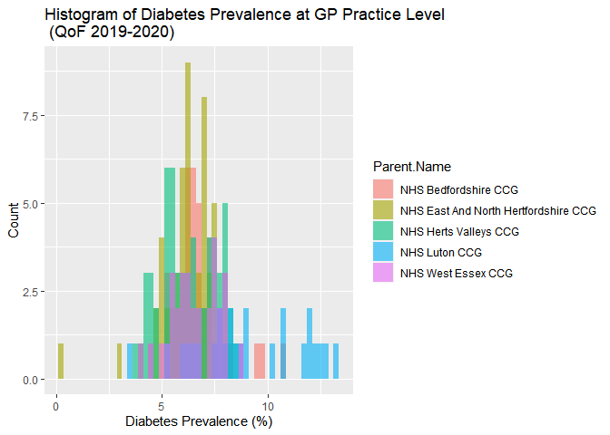<!-- -->

 

##### As we might suspect, the Luton CCG has the highest prevalence of Diabetes Mellitus as per 2019-2020 QoF data. There is also a strong association with diabetes prevalence and deprivation index with a pearson correlation coefficient of 0.67 (95% CI 0.59 - 0.74)

 

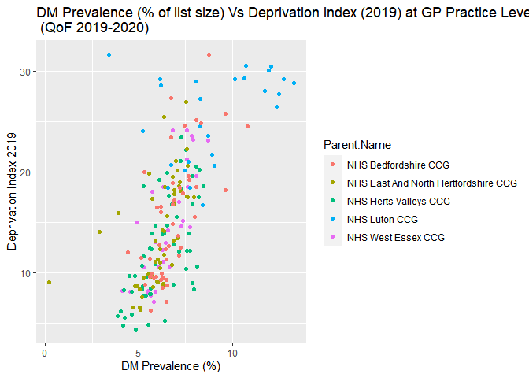<!-- -->

 

 

##### We can assess whether CKD prevalence (by CKD code) and Diabetes Mellitus Prevalence (by DM code) are correlated in GP practices by CCG.

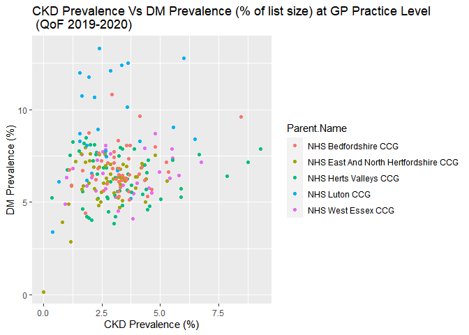<!-- -->

 

##### One might assume that populations with the highest prevalence of Diabetes may have the highest prevalence of Diabetic Nephropathy (clinical proteinuria or microalbuminuria). However, this relationship may be more complex and plotting this would be helpful way of visualising this distribution.

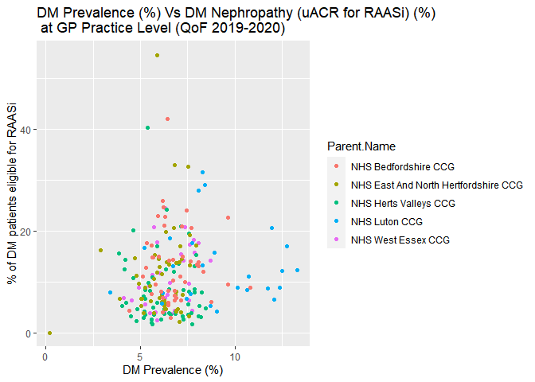<!-- -->  

 

##### Additionally, proportion data can be misleading as large practices may have a low prevalence of diabetes but have a significantly larger total diabetic population than other practices. To understand this, we can change the size of the plotted scatter points to reflect the number of patients on the GP register with diabetic nephropathy. We can then shade this ‘bubble chart’ where shading shows the proportion of patients with diabetic nephropathy on RAAS inhibition.

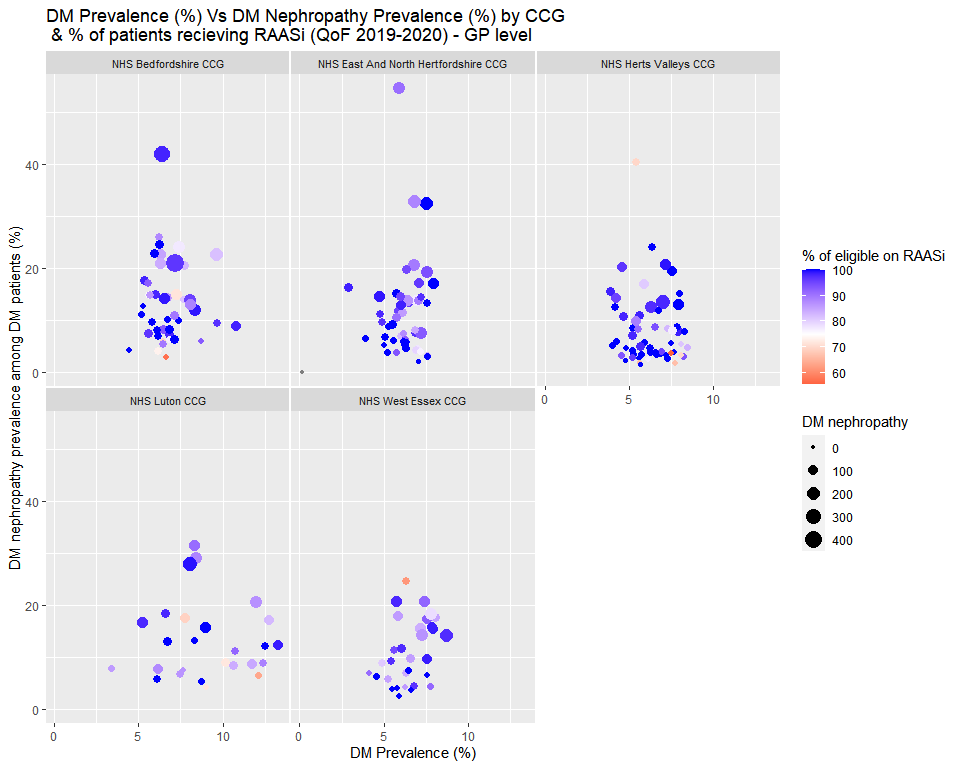<!-- -->

   

##### As the unit of intervention may be Primary Care Network (PCN), We can also group by PCN, by summing across the numerators and denominators of each individual GP practices within PCN.

#### This suggests that it is mostly small practices that do not put patients on RAAS inhibition. Additionally some of the PCN’s with the largest diabetic nephropathy patients are in the Luton and Bedford CCG

    ## `summarise()` has grouped output by 'PCN.Name'. You can override using the `.groups` argument.

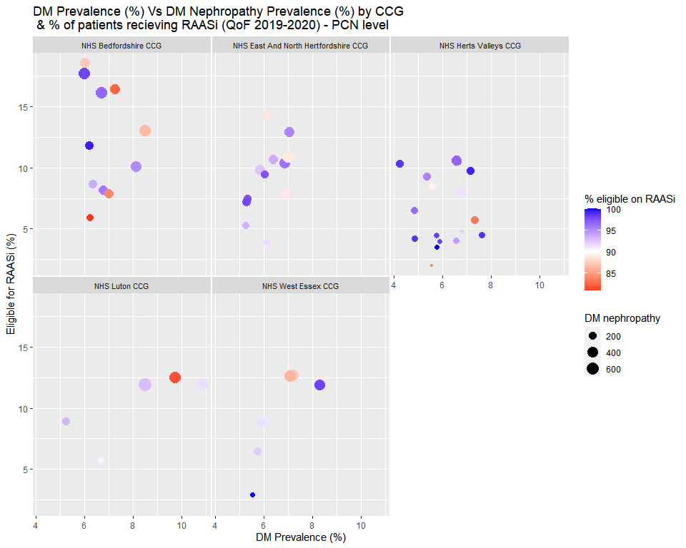<!-- -->

#### QUALITY IMPROVEMENT MEASURE \#2

##### Identifying patients who would benefit most from RAASi inhibition and facilitate prescription.

 

### National Diabetes Audit

 

##### The National Diabetes Audit Data assesses performance on a number of diabetes process measures for patients of age 12+. Although this does not show outcomes of these measures i.e. it records whether uACR was assessed but does not show how many patients actually had nephropathy,however, they do seperate by type of diabetes.

#### Data from Type II Diabetes from 1 Jan 2019 to 31 March 2020 was used in subsequent analyses - specifically in patients with type II diabetes

 

##### Renal Processes of care recorded in the National Diabetes Audit were creatinine check and uACR check in the NDA audit period

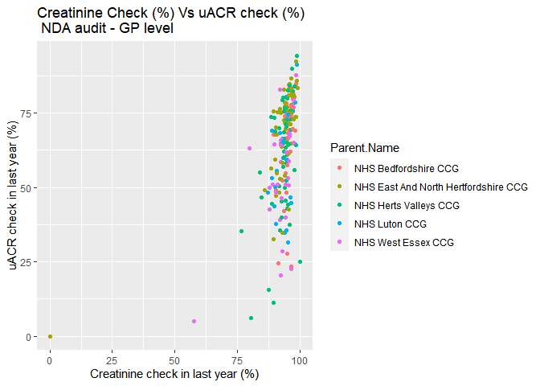<!-- -->  

##### This shows that there is significant variation in uACR check by GP practise, whereas most patients had atleast one creatinine check in the audit period.

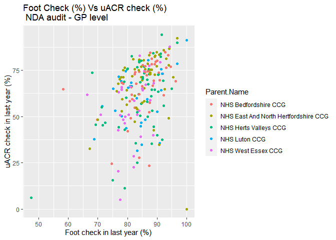<!-- -->

 

##### There is significant variation in foot checks and this is correlated with uACR measurement.

 

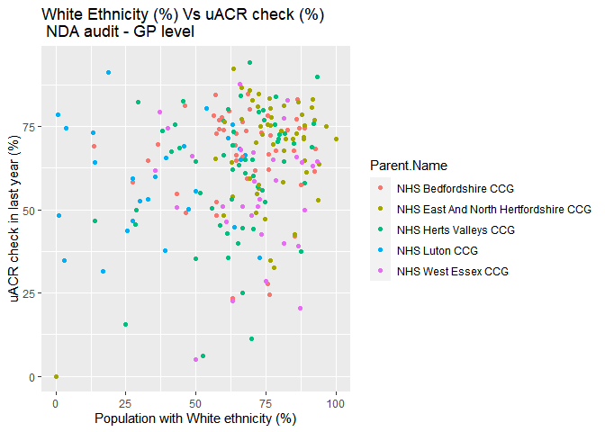<!-- -->

 

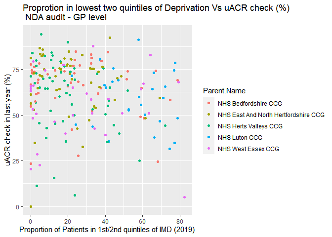<!-- -->

 

##### Potential barriers to widespread initiation of SGLT2 inhibitors in diabetic patients include

##### - uACR testing that may limit detection of diabetic nephropathy and meeting NICE criteria

##### - Foot testing may identify active foot infection

##### - Patients at highest risk of adverse renal outcomes are less likely to have uACR and diabtic foot checks.
